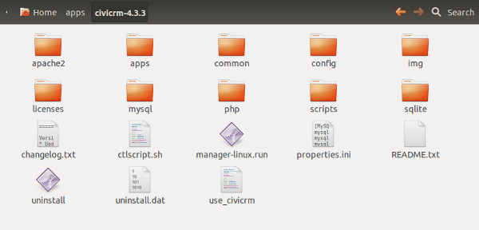

# Cómo instalar las traducciones a español de nuestro CiviCRM

Durante la primera sesión del grupo de trabajo de CiviCRM, instalamos en nuestros equipos un CiviCRM utilizando el "stack" de Bitnami. Sin embargo, ¡estaba todo en inglés!

## Motivos por los que es recomendable instalar las traducciones

Poner CiviCRM en castellano es útil por varios motivos. Aunque no te importe que las cosas estén en inglés, cuando traduces CiviCRM a castellano, también se traducen, por ejemplo, los nombres de países. Así que, si piensas utilizar formularios web para público español, es mejor que instales las traducciones. De no hacerlo, aunque podrías poner tus formularios en castellano, los nombres de todas las listas desplegables que se rellenasen automáticamente desde CiviCRM aparecerían en inglés (Spain, en vez de España).

Otro motivo por el que quieres tener en CiviCRM instaladas las traducciones al castellano, es que cuando importes datos, podrás hacerlo utilizando los nombres (de provincias, países, etc) también en español. De hecho, durante esta misma sesión (este post ha sido inicialmente pensado como guía para la segunda sesión del grupo de trabajo de CiviCRM en MediaLab-Prado), más adelante, importaremos un fichero con datos en los que importaremos datos usando palabras en castellano, como "España".

## Descargar las traducciones

Lo primero que debes hacer para poner CiviCRM en castellano es descargar las traducciones que corresponden a la versión que has instalado. En nuestro caso, la versión que instalamos con Bitnami, era la versión 4.4.3, así que lo primero es abrir la carpeta 4.4.3 del repositorio de CiviCRM en SourceForge. En esa carpeta, verás que hay un archivo que se llama civicrm-4.4.3-l10n.tar.gz. ¡Ese es el que queremos descargar!

## Descomprimir el archivo de traducciones

Este archivo es una especie de "zip" que tendremos que descomprimir. Si usas Linux, o MacOS, probablemente no tengas ningún problema para descomprimirlo. Lo normal es que puedas descomprimirlo haciendo clic con el botón derecho y pulsando "Extraer aquí", o "Descomprimir". Si usas Windows, tal vez necesites instalar un programa que permita descomprimir este tipo de archivos. [7-zip](http://www.7-zip.org/) es libre, así que puedes descargarlo e instalarlo y luego descomprimir el archivo.

Una vez descomprimido, verás una carpeta que tiene dentro dos carpetas l10n y sql. ¡Ya casi terminamos!

## Copiar los archivos en nuestro CiviCRM

Ahora tenemos que ir a donde hayamos instalado nuestro stack de Bitnami. En mi caso, lo instalé en /home/capo/apps/civicrm-4.3.3. Si abres la carpeta en la que tienes tu Bitnami, verás algo parecido a:

Como vimos durante la primera sesión, hay muchas cosas ahí dentro. Apache, MySQL, ficheros del propio Bitnami, etc. Los que nos interesa, en este caso, es dónde está instalado CiviCRM, es decir, en la carpeta apps/civicrm/htdocs. Lo que hay dentro de esa carpeta son los ficheros del Drupal que tiene dentro nuestro CiviCRM. Para llegar a los ficheros, en concreto, de CiviCRM, tenemos que entrar en sites/all/modules/civicrm. ¡Ahí es donde queremos pegar las dos carpetas que descomprimimos en el paso anterior!

## Cambiar la configuración de lenguaje de CiviCRM

Ya sólo nos queda decirle a CiviCRM que queremos que el español sea el lenguaje por defecto. Para eso:

1. Vamos a `Administer > Localization > Languages, Currency, Location`
2. Cambiamos el `Default Language` por `Spanish; Castilian (Spain)`
3. Guardamos

¡Ya tenemos CiviCRM en español! :-)
